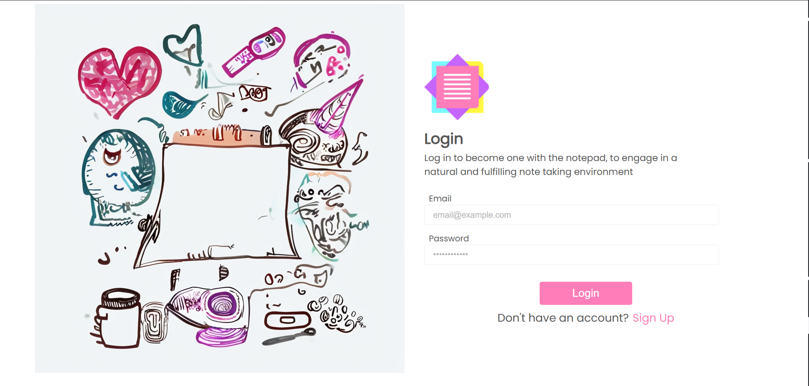

<br><br>

<!-- project philosophy -->


> A Web app that streamlines the note-taking and summerization process, powered by AI.
>
> Memo Mate aims to take the organization, review, formatting and delivery load off of the hands of the user. Memo Mate removes the need for the user to manually assess each part of their notes without having to worry about the debt they left for their future selves to tackle. We believe that each QOL improvment we can deliver to the user, the more accessible notes will be for everyone.

### User Stories

#### **Issuer**

-   As an issuer, I want to upload a set of notes when creating a bot, so that the bot can provide specific, tailored information to its users.
-   As an issuer, I want to generate and share a unique link for my bots, so that users can easily access them without needing to manually distribute instructions.
-   As an issuer, I want to update or replace the notes for an existing bot, so that the bot’s responses remain relevant and up to date.

#### **User**

-   As a user, I want to create and save my own notes, so that I can organize information relevant to my needs.
-   As a user, I want to access bots shared with me via links, so that I can quickly get information without additional setup.
-   As a user, I want to see a list of bots I’ve accessed, so that I can revisit them when needed.

#### **Admin**

-   As an admin, I want to view real-time and historical data about site performance, so that I can ensure stability and address issues proactively.
-   As an admin, I want to track token usage by the user base, so that I can manage resources and prevent abuse.
-   As an admin, I want to access statistical metrics about user engagement, so that I can make informed decisions about improving the platform.

<br><br>

<!-- Tech stack -->


### Memo Mate is built using the following technologies:

-   This project uses [Bun](https://bun.sh/) as the runtime, offering fast JavaScript and TypeScript execution for server-side applications.
-   The frontend is built with [React](https://reactjs.org/), a popular library for building interactive user interfaces.
-   For styling, the app uses the ["Poppins"](https://fonts.google.com/specimen/Poppins) font to ensure a modern and clean design.
-   The app integrates [LangChain](https://langchain.com/) a composable framework to build with LLMs.

<br><br>

<!-- UI UX -->


> We designed Memo Mate using wireframes and mockups, iterating on the design until we reached the ideal layout for easy navigation and a seamless user experience.

-   Project Figma design [figma](https://www.figma.com/design/LX7bFPB5jXNUrAW2oFh2dM/final-project-ui?node-id=0-1&t=xpt10un1OkUJpgap-1)

### Mockups

| Workspaces screen                                 | Notes Screen                            | Chats Screen                            |
| ------------------------------------------------- | --------------------------------------- | --------------------------------------- |
|  |  |  |

<br><br>

<!-- Database Design -->


### Schemas:


<br><br>

<!-- Implementation -->


### User Screens (Web)

| Login Screen                      | Signup Screen                       |
| --------------------------------- | ----------------------------------- |
|  |  |

| Workspace Screen                          | Chats Screen                     |
| ----------------------------------------- | -------------------------------- |
|  |  |

| Chat Creation                            | Diagram Creation                               |
| ---------------------------------------- | ---------------------------------------------- |
|  |  |

| Whiteboard Feature                                   |
| ---------------------------------------------------- |
|  |

<br><br>

<!-- Prompt Engineering -->


### Mastering AI Interaction: Unveiling the Power of LLM Frameworks:

-   This project utilizes LangChain's built in prompts, tailored to each LLM by the community, it is hard to beat the performance it provides. With the help of LangGraph, a robust RAG (Retrieval Augmented Generation) chatting system is created, allowing us to tap into the potential of llms.

<br><br>

<!-- How to run -->


> To set up Memo Mate locally, follow these steps:

### Prerequisites

-   bun
    ```sh
    curl -fsSL https://bun.sh/install | bash
    ```
    ```pwsh(windows)
    powershell -c "irm bun.sh/install.ps1|iex"
    ```

### Installation

_You will need to have an OpenAi api key._

1. Clone the repo
    ```sh
    git clone --recurse-submodules [github](https://github.com/zakaria-mourtaban/MemoMate.git)
    ```
2. Change directory to MemoMateBackend
    ```sh
    cd MemoMateBackend
    ```
3. Install NPM packages
    ```sh
    bun install
    ```
4. Create .env and copy .sampleenv content
    ```sh
    cp .sampleenv .env
    ```
5. Run the backend
    ```sh
    bun start
    ```
6. Change directory to MemoMateFrontend
    ```sh
    cd .. && cd MemoMateFrontend
    ```
7. Install NPM packages
    ```sh
    bun install
    ```
8. Run the frontend
    ```sh
    bun start
    ```
    Now, you should be able to run Memo Mate locally and explore its features.
