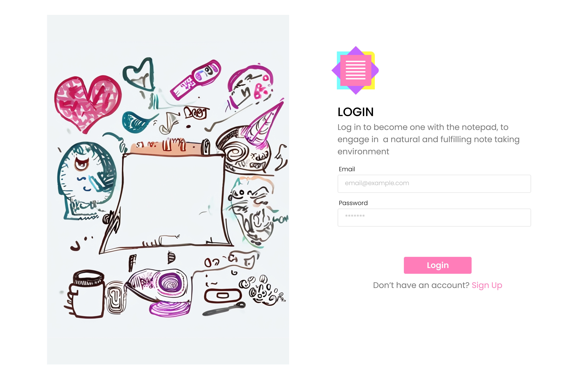
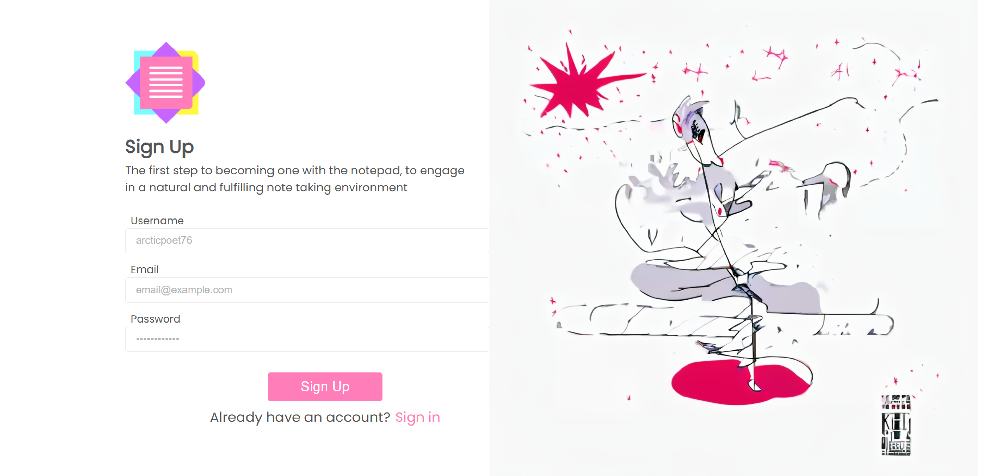

<br><br>

<!-- project philosophy -->


> A Web app that streamlines the note-taking and summerization process, powered by AI.
>
> Memo Mate aims to take the organization, review, formatting and delivery load off of the hands of the user. Memo Mate removes the need for the user to manually assess each part of their notes without having to worry about the debt they left for their future selves to tackle. We believe that each QOL improvment we can deliver to the user, the more accessible notes will be for everyone.

### User Stories

#### **Issuer**

-   As an issuer, I want to upload a set of notes when creating a bot, so that the bot can provide specific, tailored information to its users.
-   As an issuer, I want to generate and share a unique link for my bots, so that users can easily access them without needing to manually distribute instructions.
-   As an issuer, I want to update or replace the notes for an existing bot, so that the bot’s responses remain relevant and up to date.

#### **User**

-   As a user, I want to create and save my own notes, so that I can organize information relevant to my needs.
-   As a user, I want to access bots shared with me via links, so that I can quickly get information without additional setup.
-   As a user, I want to see a list of bots I’ve accessed, so that I can revisit them when needed.

#### **Admin**

-   As an admin, I want to view real-time and historical data about site performance, so that I can ensure stability and address issues proactively.
-   As an admin, I want to track token usage by the user base, so that I can manage resources and prevent abuse.
-   As an admin, I want to access statistical metrics about user engagement, so that I can make informed decisions about improving the platform.

<br><br>

<!-- Tech stack -->


### Memo Mate is built using the following technologies:

-   **[Bun](https://bun.sh/)**: Utilized as the runtime, offering fast JavaScript and TypeScript execution for server-side applications.  
-   **[React](https://reactjs.org/)**: A popular library for building interactive and dynamic user interfaces.  
-   **[Redux](https://redux.js.org/)**: Used for state management, enabling predictable state changes and easier debugging.  
-   **[SweetAlert2 (swal)](https://sweetalert2.github.io/)**: Integrated for creating elegant, customizable, and responsive alert dialogs.  
-   **[kbar](https://kbar.vercel.app/)**: Provides a command bar interface to improve user navigation and interaction.  
-   **[React-Arborist](https://react-arborist.netlify.app/)**: A tree view library used for organizing hierarchical data in a flexible and efficient way.  
-   **[Express](https://expressjs.com/)**: A minimalist and flexible Node.js framework used for building the backend API.  
-   **[JSON Web Tokens (JWT)](https://jwt.io/)**: Implements secure authentication and authorization for the application.  
-   **[MongoDB](https://www.mongodb.com/)**: A NoSQL database used for storing and managing data in a flexible, schema-free format.  
-   **[Mongoose](https://mongoosejs.com/)**: An ODM library for MongoDB, providing a straightforward way to model and interact with the database.  
-   **[PDF-Parse](https://www.npmjs.com/package/pdf-parse)**: Integrated for extracting text and metadata from PDF files to process documents effectively.  
-   **["Poppins"](https://fonts.google.com/specimen/Poppins)**: A clean and modern font used for styling to enhance the application's visual appeal.  
-   **[LangChain](https://langchain.com/)**: A composable framework that simplifies the integration of large language models (LLMs) for advanced AI-driven features.  


<br><br>

<!-- UI UX -->


> We designed Memo Mate using wireframes and mockups, iterating on the design until we reached the ideal layout for easy navigation and a seamless user experience.

-   Project Figma design [figma](https://www.figma.com/design/LX7bFPB5jXNUrAW2oFh2dM/MemoMate-UI?node-id=0-1&t=yMCD3OXg6LX3yFVN-1)

### Mockups

| login screen                                 | Notes Screen                            |
| -------------------------------------------- | --------------------------------------- |
|  |  |

<br><br>

<!-- Database Design -->


### Schemas:


<br><br>

<!-- Implementation -->


### User Screens (Web)

| Login Screen                      | Signup Screen                       |
| --------------------------------- | ----------------------------------- |
|  |  |

| Workspace Screen                          | Chats Screen                     |
| ----------------------------------------- | -------------------------------- |
|  |  |

| Chat Creation                            | Diagram Creation(flowchart)                    |
| ---------------------------------------- | ---------------------------------------------- |
|  |  |

| Whiteboard Feature                                   | Diagram Creation(gantt chart)                        |
| ---------------------------------------------------- | ---------------------------------------------------- |
|  |  |

| Supported Diagrams                                   |
| ---------------------------------------------------- |
|   |

| Retrival Augmented Generation Chat                   |
| ---------------------------------------------------- |
|     | 

<br><br>

<!-- Prompt Engineering -->


### Mastering AI Interaction: Unveiling the Power of LLM Frameworks:

-   This project utilizes LangChain's built in prompts, tailored to each LLM by the community, it is hard to beat the performance it provides. With the help of LangGraph, a robust RAG (Retrieval Augmented Generation) chatting system is created, allowing us to tap into the potential of llms.
 ## Diagram generation
  - The diagram generation uses mermaid syntax under the hood to generate the diagrams, so the usage of OpenAi's gpt-4o-mini was perfect for this application, some configuration was needed to ommit the formatting and extra comments that were left by the LLM so we settled on this prompt.
    ```
    "Everything after the prompt tag is the user prompt, generate mermaid syntax to generate the type of diagram requested by the user, do not reply to any message outside of creating these diagrams, DO NOT ADD FORMATTING, if you find that the diagram is not supported by mermaid syntax come up with a way to represent it. <prompt> " + ...
    ```
 ## Retrieval Augmented generation
 - The Retrieval Augmented Generation (RAG) is accomplished in 3 steps in my implementation, Retrieval, Augmentation, and Generation.
    Retrieval: The vector store is indexed and the relevant paragraph is retrieved (more on this later).
    Augmentaion: The retrieved paragraph is joined with the query along with the RAG prompt (more on this later).
    Generation: The LLM generates an output based on the provided information.

 - The RAG Prompt, is a simple prompt provided by LangSmith (part of LangChain) and its goes like this:
    ```
    You are an assistant for question-answering tasks. Use the following pieces of retrieved context to answer the question. If you don't know the answer, just say that you don't know. Use three sentences maximum and keep the answer concise.
    Question: {question} 
    Context: {context} 
    Answer:
    ```
- The vector store, Before we can provide the LLM with the context it needs, our data goes through multiple steps, firstly the data is converted to a simple string and recursively split into parts where a certain amount of overlap is set, this overlap minimizes the loss of context that happens when splitting the text, after the text is split OpenAi's embedding api is used to create the numerical representation of the text that will then be stored in the vector store(specialized store for vectors), after all the data is stored the vector store is preserved as a file for later usage(in my implementation), after that whenever we need to retrieve a certain piece of context, a similarity search is conducted(between the query and the vector store documents) using "cosine similarity", after the search is conducted if a match has been found, the resulting document is added to the context of the chat bot for the generation.

#### Thankfully, the heavy lifting of the actual implementation of these steps is already standard in libraries like the on im using which lightens the technical load of such a system and allows exploration into such subjects to be smoother and more effiecient.
<!-- AWS Deployment -->


###  Backend Deployment:

- We deployed the backend of our application by setting up an AWS EC2 instance to host the server. After provisioning the instance, we configured it with the necessary environment and dependencies, including the Bun runtime for efficient JavaScript execution. We created a custom startup script and registered it as a systemd service to ensure the backend runs automatically on system boot. Additionally, we verified file permissions, set up the appropriate environment variables, and tested the service to confirm reliability. This setup ensures a scalable and consistent deployment for our application's backend.

<br><br>

<!-- How to run -->


> To set up Memo Mate locally, follow these steps:

### Prerequisites

-   bun
    ```sh
    curl -fsSL https://bun.sh/install | bash
    ```
    ```pwsh(windows)
    powershell -c "irm bun.sh/install.ps1|iex"
    ```

### Installation

_You will need to have an OpenAi api key._

1. Clone the repo
    ```sh
    git clone --recurse-submodules [github](https://github.com/zakaria-mourtaban/MemoMate.git)
    ```
2. Change directory to MemoMateFrontend
    ```sh
    cd MemoMateFrontend
    ```
3. Install NPM packages
    ```sh
    bun install
    ```
4. Run the frontend
    ```sh
    bun start
    ```
    Now, you should be able to run Memo Mate locally and explore its features.
